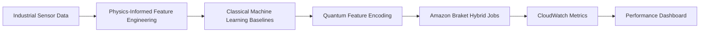
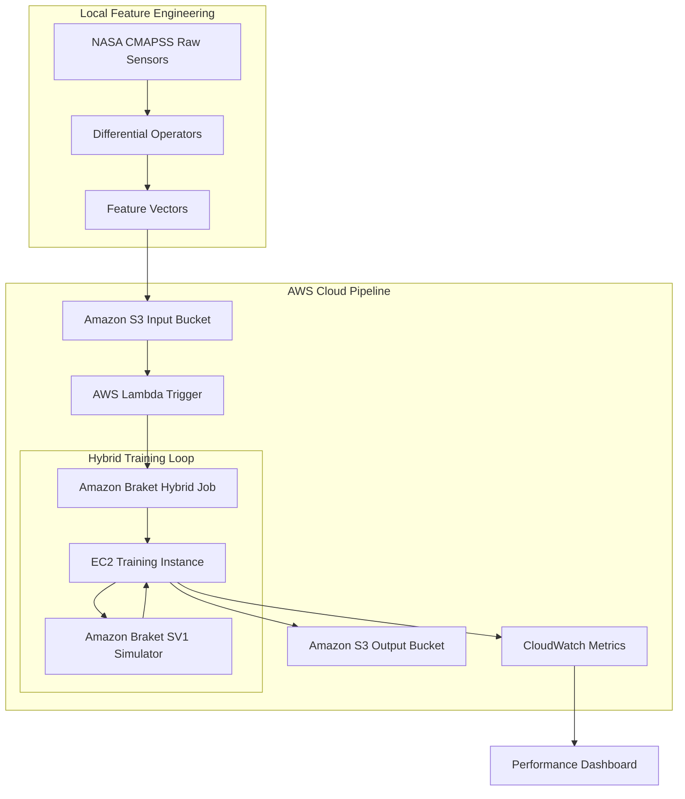

# Cloud-Native Physics-Informed Hybrid Quantum Predictive Maintenance System

### Amazon Braket | PennyLane | PyTorch | AWS Infrastructure | Quantum Machine Learning

> A cloud-native hybrid quantum-classical machine learning framework for predictive maintenance of industrial assets. The system combines **physics-informed feature engineering**, **classical machine learning baselines**, and **variational quantum circuits (VQCs)** executed on **Amazon Braket** to investigate quantum-enhanced representation learning for industrial AI applications.

---

## 🎯 Motivation

Unexpected equipment failures in industrial systems such as turbines, pumps, compressors, and manufacturing machinery lead to substantial operational and financial losses. Predictive maintenance aims to anticipate these failures before they occur, reducing downtime and optimizing maintenance schedules.

This project explores whether **hybrid quantum machine learning models** can complement traditional approaches by:

* Incorporating **physics-informed features** derived from sensor dynamics.
* Leveraging **parameterized quantum circuits (PQCs)** for representation learning.
* Building an **AWS-native architecture** capable of scaling from local simulations to cloud-based quantum hardware.

---

## 🏭 Industrial Applications

* Predictive maintenance for manufacturing equipment
* Industrial IoT asset monitoring
* Aerospace engine health management
* Digital twin systems
* Smart maintenance scheduling
* Failure prediction for critical infrastructure

---

# 🏗️ System Architecture



---

# ☁️ AWS Cloud Architecture



---

# ⚙️ Workflow

```text
NASA CMAPSS Dataset
        ↓
Physics-Informed Feature Engineering
        ↓
Classical Baseline Models
        ↓
Quantum Feature Encoding
        ↓
Variational Quantum Circuit
        ↓
Amazon Braket Hybrid Jobs
        ↓
Performance Evaluation
        ↓
Dashboard & Reporting
```

---

# 🔬 Physics-Informed Feature Engineering

Instead of relying solely on raw sensor measurements, the pipeline extracts physically meaningful dynamics using numerical differentiation.

### Temperature Gradient

```math
\frac{dT}{dt} \approx \frac{T_t - T_{t-1}}{\Delta t}
```

### Vibration Gradient

```math
\frac{dv}{dt} \approx \frac{v_t - v_{t-1}}{\Delta t}
```

### Additional Engineered Features

* Rolling averages
* Standard deviations
* RMS vibration
* Energy dissipation rates
* Sensor trend indicators

These features introduce domain knowledge into the learning process and improve robustness against noisy sensor data.

---

# 🤖 Classical Machine Learning Baselines

To establish performance boundaries, the following models are benchmarked:

* Random Forest
* XGBoost
* Multi-Layer Perceptron (MLP)

---

# ⚛️ Quantum Machine Learning Pipeline

The quantum layer is implemented using:

* PennyLane
* Amazon Braket
* PyTorch

### Quantum Workflow

```text
Feature Vector
      ↓
Angle Encoding
      ↓
4-Qubit Variational Circuit
      ↓
Measurement
      ↓
Classical Output Layer
      ↓
Failure Prediction
```

### Circuit Components

* Angle Embedding
* Parameterized `RY` and `RZ` rotations
* Entangling `CNOT` layers
* Expectation value measurements

---

# 💡 Why Quantum for Industrial AI?

This project investigates whether **Parameterized Quantum Circuits (PQCs)** can provide richer feature representations than classical methods.

### Expressive Feature Spaces

Quantum feature maps project high-dimensional sensor data into complex Hilbert spaces, potentially uncovering subtle multi-sensor correlations.

### Hybrid Learning

The architecture combines:

* Quantum representation learning
* Classical optimization via PyTorch
* Cloud-scale execution using Amazon Braket

---

# 📊 Benchmark Results

## Classical Baselines

| Model         | Accuracy   | F1-Score   | Inference Time |
| ------------- | ---------- | ---------- | -------------- |
| Random Forest | 94.16%     | 79.42%     | 5.61 sec       |
| XGBoost       | **94.40%** | **80.10%** | **0.56 sec**   |

## Quantum Prototype (PoC)

| Model                   | Accuracy | Status       |
| ----------------------- | -------- | ------------ |
| 4-Qubit Variational QNN | 85.25%   | Experimental |

---

# 💰 AWS Braket Cost Analysis

| Backend           | Latency  | Billing            | Estimated Cost |
| ----------------- | -------- | ------------------ | -------------- |
| Local Simulator   | 4.5 sec  | Free               | $0             |
| Amazon Braket SV1 | ~15 sec  | $0.075/min         | ~$0.24/run     |
| Physical QPU      | Variable | Hardware dependent | Variable       |

---

# 📁 Repository Structure

```text
Cloud-Native-Physics-Informed-Hybrid-Quantum-Predictive-Maintenance-System
│
├── data/
├── notebooks/
├── src/
│   ├── preprocessing.py
│   ├── feature_engineering.py
│   ├── classical_models.py
│   ├── quantum_model.py
│   ├── train.py
│   └── evaluate.py
│
├── aws/
│   └── submit_braket_job.py
│
├── figures/
├── reports/
├── docs/
└── README.md
```

---

# 🗺️ Development Roadmap

```text
Phase 1 → Dataset Acquisition
Phase 2 → Physics-Informed Feature Engineering
Phase 3 → Classical Baseline Calibration
Phase 4 → Variational Quantum Circuit Design
Phase 5 → AWS Containerization
Phase 6 → Dashboard & Reporting
```

---

# 🔮 Future Work

* Execute experiments on physical quantum hardware via Amazon Braket.
* Remaining Useful Life (RUL) prediction.
* Multi-class fault diagnosis.
* Digital twin integration.
* Containerized enterprise deployment.
* CI/CD and MLOps pipeline integration.

---

# 📚 References

1. Saxena, A., & Goebel, K. (2008). *Turbofan Engine Degradation Simulation Data Set*. NASA Ames Prognostics Data Repository.
2. Amazon Braket Developer Guide.
3. Bergholm, V. et al. (2018). *PennyLane: Automatic differentiation of quantum circuits*. arXiv:1811.04968.

---

# 🎤 Interview Elevator Pitch

> Developed a cloud-native hybrid quantum-classical predictive maintenance framework that combines physics-informed feature engineering, classical machine learning baselines, and variational quantum circuits executed through Amazon Braket. The project investigates whether quantum representation learning can improve industrial failure prediction while maintaining an enterprise-ready AWS architecture.
